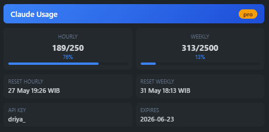

# Claude Usage

Track penggunaan Claude API Anda langsung dari status bar VS Code.

## Fitur

- **Status Bar Display** - Menampilkan usage limit saat ini (contoh: `Claude: 77/250`)
- **Sidebar Dashboard** - Panel interaktif dengan statistik lengkap (hourly & weekly usage, reset times)
- **Auto Refresh** - Data otomatis diperbarui setiap 5 menit
- **Manual Refresh** - Klik pada status bar atau jalankan command `Refresh Claude Usage`
- **Tooltip Info** - Arahkan mouse ke status bar untuk melihat detail lengkap

## Preview

Status bar menampilkan: `$(cloud) Claude: {current}/{max}`

Tooltip menampilkan detail lengkap penggunaan API.

Sidebar panel menampilkan dashboard dengan statistik lengkap.

## Requirement

- VS Code versi 1.120.0 atau lebih baru
- Koneksi internet untuk mengambil data dari API

## Installation

1. Clone repository ini
2. Jalankan `npm install`
3. Jalankan `npm run compile` untuk compile TypeScript
4. Jalankan `npm run package` untuk membuat file `.vsix`
5. Instal ke VS Code:
   - Klik ikon **Extensions** di menu paling kiri VS Code (atau tekan `Ctrl + Shift + X`)
   - Di pojok kanan atas panel Extensions, klik ikon **Titik Tiga (...)**
   - Pilih menu **Install from VSIX...**
   - Cari dan pilih file `claude-usage-0.0.1.vsix` yang baru saja Anda buat

## Development

Tekan `F5` di VS Code untuk membuka jendela Extension Development Host.

## Commands

| Command | Deskripsi |
|---------|-----------|
| `claude-usage.refreshData` | Refresh data penggunaan manual |

## API Endpoint

Extension ini mengambil data dari `https://ai.bluepack.my.id/api/check-usage`. Pastikan endpoint tersebut accessible dari mesin Anda.

## Teknologi

- TypeScript
- VS Code Extension API
- Webpack untuk bundling

## Lisensi

MIT
